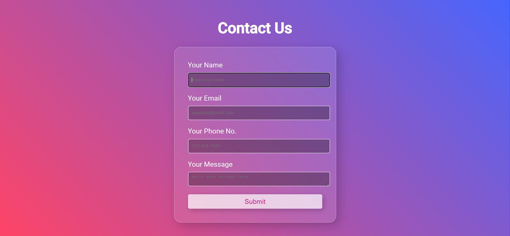

# 🌟 LandingForm 🌟



## 📜 Description
Welcome to `LandingForm`! Dive into an elegant transparent landing page integrated with a contact form. This

project encapsulates modern web design principles, prominently featuring the trending glassmorphism effects with gradient accents.

## 🌈 Features

- **Glassmorphism Design**: Sleek and modern UI that stands out.
- **Responsive**: Adapts perfectly to various screen sizes, from mobile to desktop.
- **User-Friendly**: Intuitive design that ensures a seamless user experience.
- **Integrated Contact Form**: Easily customizable for your needs.

## 🛠️ Setup

1. **Clone the Repository**
```bash
git clone https://github.com/your_username/LandingForm.git
```

2. **Navigate to the directory**
```bash
cd LandingForm
```

3. **Open with Live Server** (If using VSCode with the Live Server extension)
   - Right-click `index.html` and select 'Open with Live Server'.

4. Alternatively, you can just open `index.html` with your preferred browser.

## 🖼️ Customization

Feel free to adapt the color schemes, fonts, and any other design elements to match your brand or preferences. The code is well-commented to aid any modifications you might wish to make.

## 📌 ToDo

- [ ] Integrate with backend services for form submission.
- [ ] Add more interactive elements and animations.
- [ ] Ensure cross-browser compatibility.

## 🤝 Contributing

Pull requests are welcome! For major changes, please open an issue first to discuss what you would like to change. Ensure you update the tests as appropriate.

## 📝 License

[MIT](https://choosealicense.com/licenses/mit/)

## 🌐 Contact

For more information, queries, or feedback, please reach out to: `itsdchanda@gmail.com`.

---

**Happy Coding!** 🚀